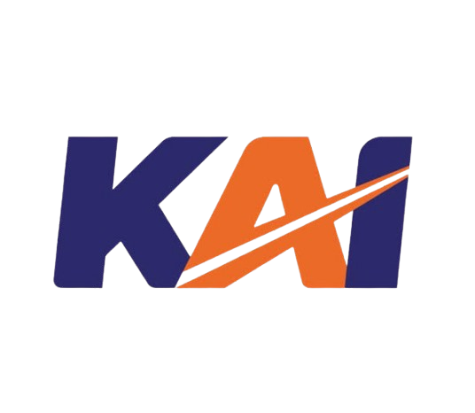

<div align="center">
  
  
  # SIVERA IV
  **Sistem Informasi Visualisasi & Evaluasi Resort Aset**
  
  <p align="center">
    Aplikasi manajemen, visualisasi pemetaan, dan evaluasi aset IT terintegrasi khusus untuk Divre IV Tanjung Karang.
  </p>

  [](https://laravel.com)
  [](https://reactjs.org/)
  [](https://inertiajs.com/)
  [](https://tailwindcss.com)
</div>

---

## 🚀 Fitur Utama

- 📍 **Peta Visualisasi Interaktif**: Melihat sebaran aset secara langsung melalui pemetaan stasiun dan unit kerja Divre IV Tanjung Karang.
- 🏗️ **Dynamic Schema Builder**: Membuat dan mengelola berbagai jenis aset (CCTV, PC, Printer, dll) dengan kolom tabel yang bisa dikustomisasi secara dinamis (Drag & Drop).
- 📝 **Editable Asset Table (Excel-like)**: Mengelola data aset semudah menggunakan Microsoft Excel. Mendukung edit langsung pada sel (inline editing) dan navigasi menggunakan *keyboard*.
- 📊 **Dashboard & Statistik Terintegrasi**: Laporan kondisi aset (Baik, Rusak, Perawatan) disajikan dalam angka dan visualisasi *real-time*.
- 📑 **Export Laporan (Excel & CSV)**: Ekspor data aset secara instan dengan satu klik untuk keperluan pelaporan manajemen.
- 👥 **Manajemen Pengguna (RBAC)**: Pembagian akses terstruktur antara Admin dan Superadmin.
- 🎨 **Antarmuka Premium & Responsif**: Dibangun dengan Tailwind CSS untuk menghadirkan desain modern (glassmorphism, micro-animations) yang responsif di segala perangkat.

## 🛠️ Teknologi yang Digunakan

- **Backend**: Laravel 11.x, PHP 8.3+
- **Frontend**: React.js 18.x, Inertia.js
- **Styling**: Tailwind CSS
- **Database**: MySQL / MariaDB
- **Utilities**: SweetAlert2 (Alerts), Maatwebsite/Excel (Export), React-Easy-Crop (Image Cropping)

## 📦 Panduan Instalasi (Development)

Ikuti langkah-langkah di bawah ini untuk menjalankan sistem di lingkungan pengembangan (*local machine*):

### Prasyarat
- PHP >= 8.3
- Node.js >= 18.0 & NPM
- Composer
- MySQL

### Instalasi Langkah demi Langkah

1. **Kloning Repositori**
   ```bash
   git clone https://github.com/RiskiJayaPutra/SIVERA-IV.git
   cd SIVERA-IV
   ```

2. **Install Dependensi PHP & Node.js**
   ```bash
   composer install
   npm install
   ```

3. **Konfigurasi Environment**
   Salin file `.env.example` menjadi `.env`.
   ```bash
   cp .env.example .env
   ```
   Lalu sesuaikan konfigurasi database (`DB_DATABASE`, `DB_USERNAME`, `DB_PASSWORD`) di dalam file `.env`.

4. **Generate Application Key & Link Storage**
   ```bash
   php artisan key:generate
   php artisan storage:link
   ```

5. **Migrasi Database & Seeding**
   ```bash
   php artisan migrate --seed
   ```

6. **Kompilasi Frontend (Vite)**
   ```bash
   npm run build
   ```

7. **Jalankan Server Lokal**
   ```bash
   php artisan serve
   ```
   Aplikasi dapat diakses di `http://localhost:8000`.

## 🔐 Akun Default
Secara default, proses *seeding* akan membuatkan akun superadmin untuk Anda:
- **Email**: superadmin@kai.id
- **Password**: password123

## 🏗️ Struktur Direktori Utama
- `app/` - Inti logika aplikasi (Models, Controllers, Exports)
- `resources/js/Pages/` - Tampilan React / Halaman (Dashboard, Master Aset, dll)
- `resources/js/Components/` - Komponen React *Reusable* (Tabel Edit, Modal, dll)
- `routes/web.php` - Daftar rute aplikasi

## 🛡️ Keamanan & Lisensi

Sistem ini dikembangkan khusus untuk keperluan internal. Mohon menjaga kerahasiaan *source code* dan data yang ada di dalamnya.

---
*Developed with ❤️ for Divre IV Tanjung Karang.*
